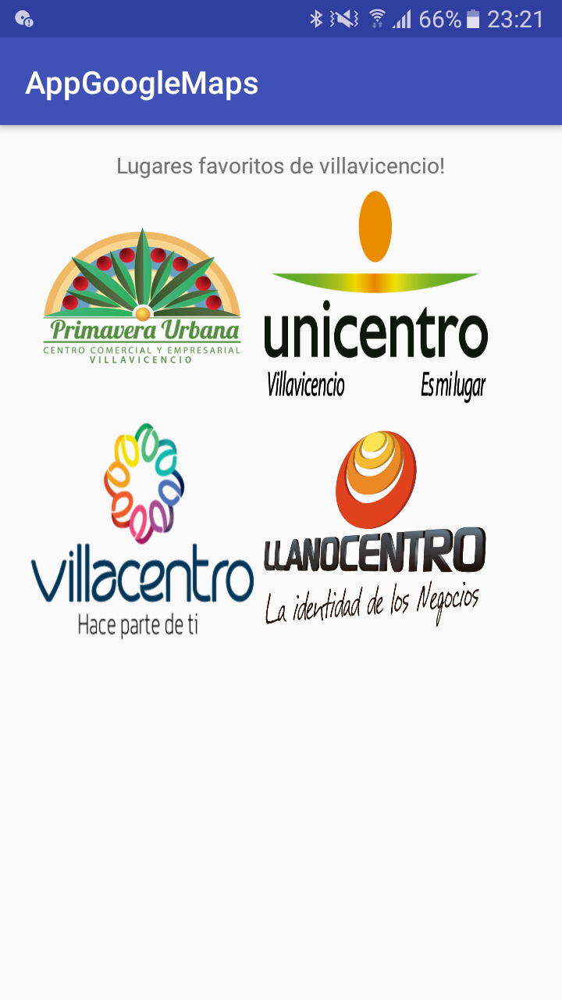
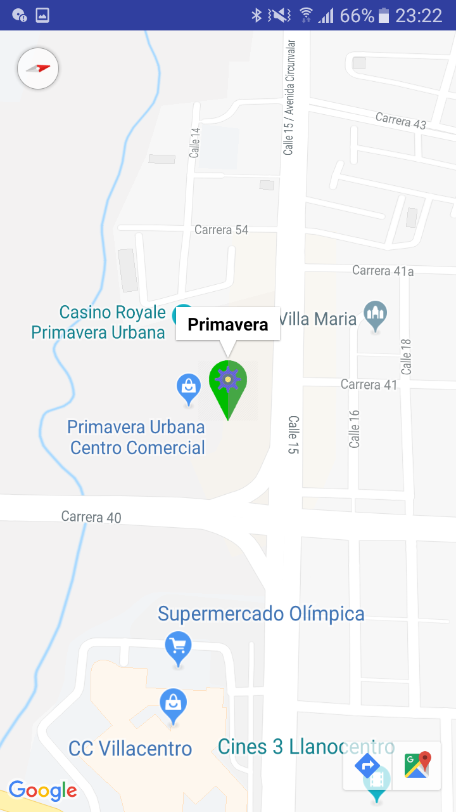
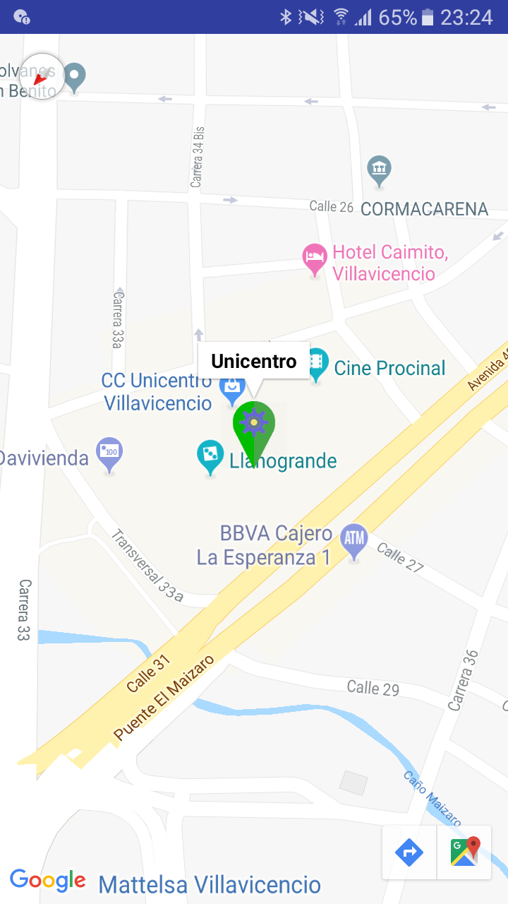
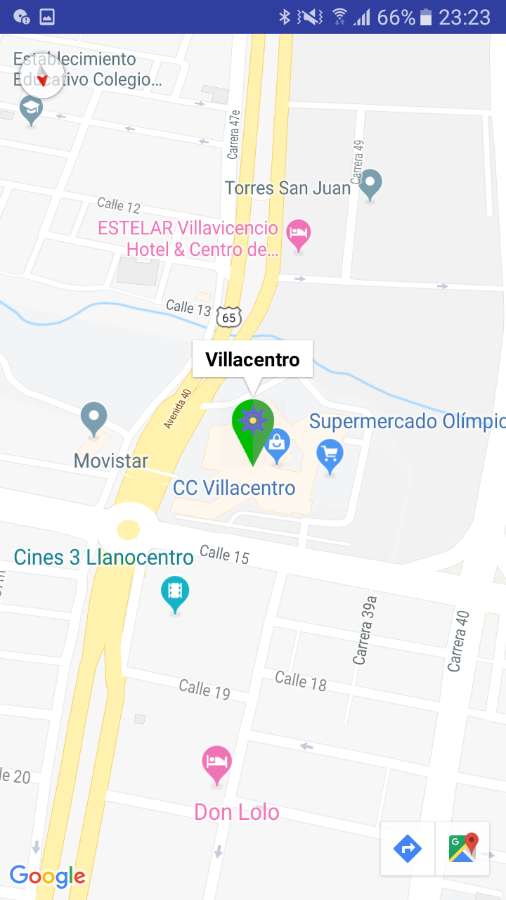
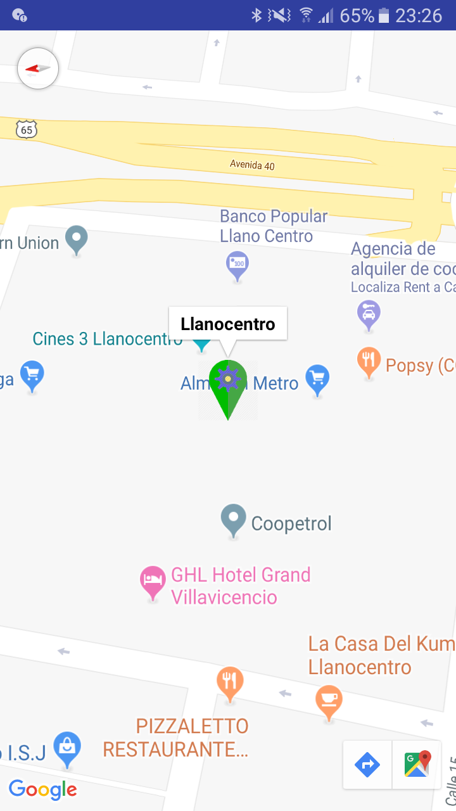

# AppGoogleMaps

Proyecto de la semana 1 del curso de Desarrollo de aplicaciones avanzadas con Android en Coursera.org

# Para poder usar esta App
* [X] Usa tu propio ACCESS_TOKEN

Para realizar la prueba de esta App debes disponer de un ACCESS_TOKEN del API de Instagram

En caso de no tener uno, consigue el tuyo en la página para desarrolladores de Instagram.

Este ACCESS_TOKEN es obligatorio para consumir el API.

Agrega tu ACCESS_TOKEN en la clase ConstRestApi, del paquete restApi, en la linea 13:
public static final String ACCESS_TOKEN = "";
En medio de las comillas sin espacios.

# Para poder enviar Email
* [X] Usa tu propio correo de Gmail
Adicionalmente, si deseas enviar un correo usando esta aplicación, deberás modificar el archivo strings.xml y usar tu propio correo electrónico.

# Para usar los mapas
* [X] Usa tu propio API ACCESS KEY de google.
Para probar esta aplicación debes utilizar tu propio API ACCESS KEY de google. en el archivo google_maps_api.xml en la línea 19

## Los requisitos anteriores por cuestión de seguridad.

 * Pantalla principal que contiene las ubicaciones más concurridas.

 * Mapa 1

 * Mapa 2

 * Mapa 3

 * Mapa 4

